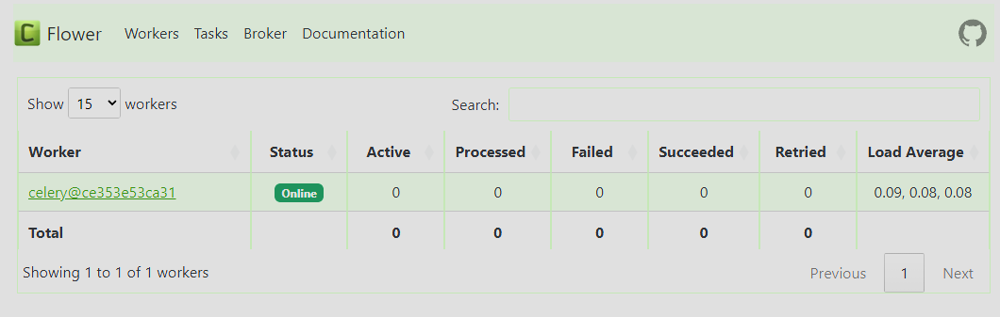

# Project Specifications

This specification incorporates Redis as a cache layer to enhance the performance and scalability of your real-time sentiment analysis service.

Tools:

Backend: FastAPI (Python)
Database: PostgreSQL
Message Queue: RabbitMQ
Workflow Orchestration: Apache Airflow
Reverse Proxy: Traefik
API Frameworks: REST API (using FastAPI)

Cache: Redis
Data Pipeline:

Data Ingestion:

Users submit text data or a script streams data as before.
Sentiment Analysis with Caching:

Before processing messages from RabbitMQ, worker tasks check the Redis cache for the specific text data.
If the sentiment analysis for the data already exists in the cache, the result is retrieved and returned directly, reducing database load and improving response times.
If the data is not found in the cache, sentiment analysis is performed using libraries like NLTK or TextBlob, and the result is stored in both the PostgreSQL database and the Redis cache for future requests.
API Endpoints:

REST APIs function as described previously.
When retrieving results, the API checks the Redis cache first before querying the database, further enhancing performance.
Benefits of using Redis:

Improved Response Times: Frequently accessed sentiment analysis results are readily available in memory, reducing database load and speeding up responses.
Reduced Database Load: Caching lowers the number of database queries, improving overall system performance and scalability.
Data Consistency: Implement cache invalidation strategies to ensure data consistency between Redis and PostgreSQL.
Additional Considerations:

Cache Invalidation: Update the cache whenever the corresponding data in the database changes to maintain consistency. Explore eviction policies to manage cache size effectively.
Cache Key Design: Design meaningful and efficient cache keys to optimize cache utilization and retrieval speed.
Optional Tools:

Machine Learning models
This enhanced architecture provides a more performant and scalable solution for real-time sentiment analysis. By leveraging Redis caching, you can significantly improve response times and handle larger data volumes efficiently.

## How to use?
This project is based in docker, so the first thing that we need to do is build the image `docker-compose.yaml`.

When this docker image is build, Traefik will work like reverse proxy, to redirect all the petitions to `localhost:9000`.

In this port we have the following services:
- The api (`localhost:9000/api/v1`)
- Grafana (`localhost:9000/grafana`)
    - User: admin
    - Password: foobar

- Prometheus (`localhost:9000/prom`)
- RabbitMQ (`localhost:9000/rabbitmq/dashboard/#/`)
    - User: rabbitmq
    - Password: rabbitmq

To monitoring traefik, we use the endpoint `localhost:9100/dashboard`

To use the api, we can use tools like postman, curl, or any tool that allow us to send petitions. The easy way to make test, are using the `docs` that FastAPI have.

- `localhost:9000/api/v1/docs`

This API is divided in 3 sections:
- Users
- Auth
- Sentiment Analisys.

To make use the API we need to create an user and authenticate with the basics (user, password) methods.

The endpoints that don't have the `async` prefix are not asynchronous and use redis to improve the performance. The endpoints with `async` use celery and rabbitmq to make background tasks.
This last return an `id` that we can use to check the status of the task (`/analysis/tasks/{task_id}`).

To check the behaviour of the Celery and this tasks, with the `localhost:5555` we have access to flower, to monitoring the tasks.

